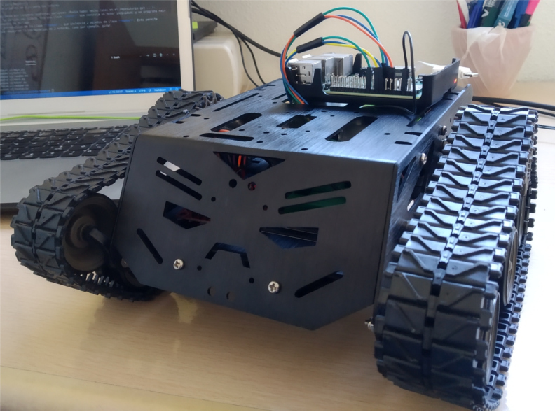
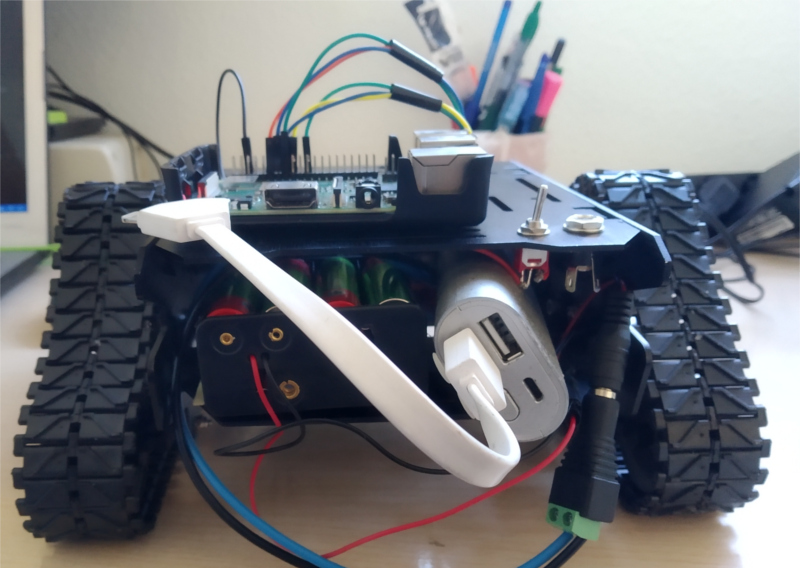

# Tanque Python - Rasperry
Pruebas de configuración y programación en Python del tanque Devastator:

[Chasis del tanque]: https://www.dfrobot.com/product-1477.html

Por ahora, estoy usando:
* Raspberry Pi 3b+
* Python 3
* Batería 5v para Raspberry
* 8 pilas recargables de 1,2v para los motores

Estoy organizando por carpetas distintas versiones (Podía haber hecho ramas en el repositorio git ...):
1. **v1**: la versión más simple. Uso una clase **motor** que controla un motor individual y un programa main que lee comandos de teclado.
1. **v2**: Introducción de la clase **Tanque**, que instancia 2 objetos de clase **motor**. Esto permite acciones que requieren la coordinación de 2 motores, como por ejemplo, girar.
